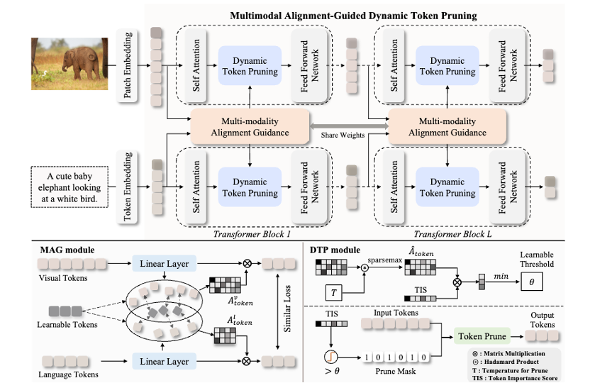

# MADTP: Multimodal Alignment-Guided Dynamic Token Pruning for Accelerating Vision-Language Transformer

<p align="center"> <a href="https://arxiv.org/pdf/2403.02991.pdf" target="_blank">[Paper]</a> 
<a href="https://arxiv.org/abs/2403.02991" target="_blank">[ArXiv]</a> 
<a href="https://github.com/double125/MADTP" target="_blank">[Code]</a>



Official implementation of [MADTP: Multimodal Alignment-Guided Dynamic Token Pruning for Accelerating Vision-Language Transformer](https://arxiv.org/abs/2403.02991). 

### What's New 🥳

* (MAR 27, 2024), the code(including the ```implementation```，```scripts```，```checkpoints``` and ```logs``` of MADTP will come soon.[[Code]](https://github.com/double125/MADTP") 🚩

* (Feb 27, 2024), MADTP: Multimodal Alignment-Guided Dynamic Token Pruning for Accelerating Vision-Language Transformer was accepted by CVPR 2024. [[Paper]](https://arxiv.org/pdf/2403.02991.pdf) [[ArXiv]](https://arxiv.org/abs/2403.02991). 🎉

### Acknowledgments
This code is built upon <a href="https://github.com/salesforce/BLIP">BLIP</a>, <a href="https://github.com/openai/CLIP">CLIP</a>, <a href="https://github.com/sdc17/UPop">UPop</a>, and <a href=https://github.com/huggingface/pytorch-image-models/tree/main/timm>timm</a>. We thank the original authors for their open-source work.


### Citation
If you find this work useful, please consider citing the corresponding paper:
```bibtex
@article{cao2024madtp,
  title={MADTP: Multimodal Alignment-Guided Dynamic Token Pruning for Accelerating Vision-Language Transformer},
  author={Jianjian, Cao and Peng, Ye and Shengze, Li and Chong, Yu and Yansong, Tang and Jiwen, Lu and Tao, Chen},
  journal={IEEE Conference on Computer Vision and Pattern Recognition},
  year={2024}
}
```
